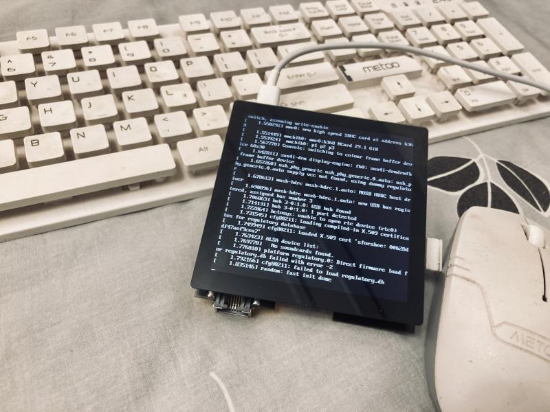
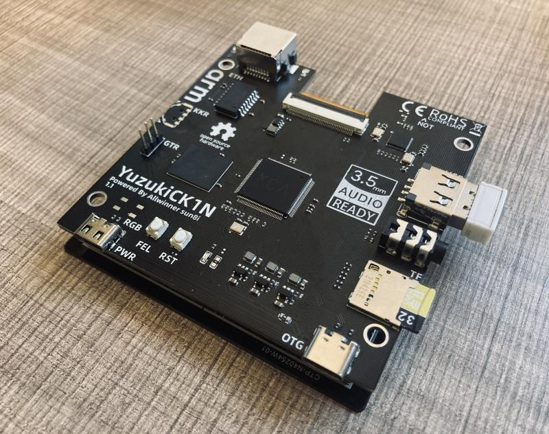

# YuzukiCK1N
YuzukiCK1N 86 Panel Solution for IoT and HMI.

https://oshwhub.com/GloomyGhost/yuzukick1n

## About

YuzukiCK1N is a basic 86 Panel Solution for IoT based on the Allwinner V3x chip design. Licensed under [CERN Open Hardware Licence Version 2 - Strongly Reciprocal](https://spdx.org/licenses/CERN-OHL-S-2.0.html)

- Support RGB 86 Panel display interface;
- Support CTP interface;
- Support HPOUT interface;
- Integrated Allwinner XR829 WiFi/BT chip;
- Support UART debug;
- Support SD Card Boot;
- Support USB Host/Device;
- eMMC 8Bit 
- YuzukiSBC-Buildroot

It can be used for chip evaluation, program pre-research and personal DIY, and can be applied to product forms such as game consoles, smart commercial displays, HMI, and smart central control.

## SDK Software

- https://github.com/YuzukiHD/Buildroot-YuzukiSBC

## Links

OSHWHub OpenSource (Chinese): https://oshwhub.com/GloomyGhost/yuzukick1n

